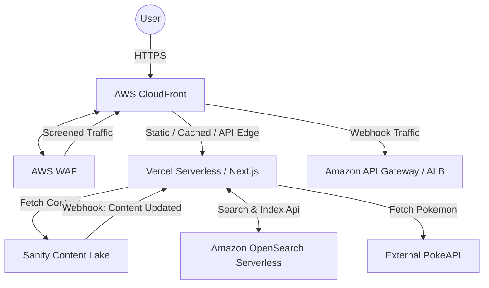

# AWS Architecture for Next.js 16 with OpenSearch

This document outlines the high-level architecture for deploying the `turbo-start-sanity1` application securely on AWS.

## Architecture Diagram

## 1. CloudFront TTL Strategy (Next.js 16 App Router)

Next.js 16 intelligently handles cache invalidation with ISR and Server Actions. AWS CloudFront must be configured to respect Next.js's headers while efficiently caching static assets.

**Recommended Cache Behaviors:**
*   `/api/*`: **TTL 0 (No Cache)** 
    *   Let Next.js Handle Cache-Control. We don't want outdated search results or failed re-indexes.
*   `/_next/static/*` and `/images/*`: **TTL 31536000 (1 Year)**
    *   Next.js assets are immutable. Maximize caching to reduce latency.
*   `/*` (Default): **TTL Respect Origin**
    *   Forward `Cache-Control` headers exactly as returned by Vercel/Next.js. 
    *   ISR endpoints (like `/pokedex/[name]`) will output `s-maxage=86400, stale-while-revalidate`, which CloudFront understands natively.

## 2. AWS WAF Rules

Attach an AWS WAF WebACL to the CloudFront Distribution.

### Rule 1: Rate Limiting
Prevent volumetric DDoS attacks and API abuse on your `/api/search` and `/api/reindex` endpoints.
*   **Action**: Block
*   **Statement**: Rate Based
*   **Limit**: 1,000 requests per 5 minutes per IP.
*   *Note*: Exempt Sanity's Webhook IP addresses if applying this globally.

### Rule 2: SQLi and XSS Mitigation
*   **Action**: Block
*   **Statement**: AWS Managed Rules `AWSManagedRulesCommonRuleSet`
*   **Scope**: Protects against common SQL injection (`SQLi`), Cross-Site Scripting (`XSS`), and other OWASP Top 10 vulnerabilities. Note that we don't use a SQL database directly here, but OpenSearch can be vulnerable to injection (NoSQL/ElasticSearch injection); this rule provides basic payload sanitization.

### Rule 3: Sanity Webhook Protection (Strict Validation)
*   **Action**: Block
*   **Statement**: If URI starts with `/api/reindex` AND the `Sanity-Webhook-Signature` header is **Absent**.
*   *Implementation Strategy*: Further validation of the Sanity signature must happen in the Next.js API route itself.

## 3. Graceful Degradation Strategy
The Next.js Search API (`/api/search`) correctly implements graceful degradation:
* If the `Amazon OpenSearch Serverless` cluster scales down or becomes temporarily unresponsive, the `try/catch` block swallows the error.
* The API falls back to returning an empty array `[]` (or exclusively PokeAPI results if matched), preventing a fatal `500 Internal Server Error` and keeping the frontend functional.
